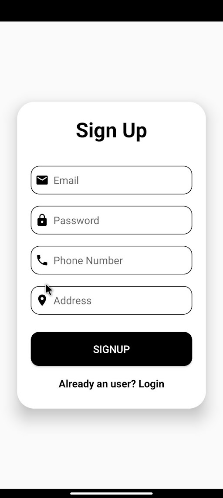
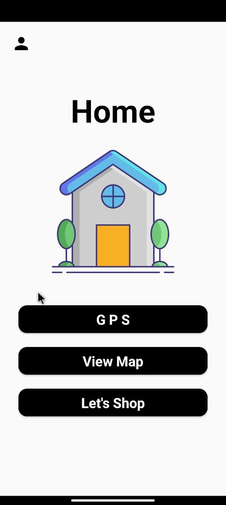
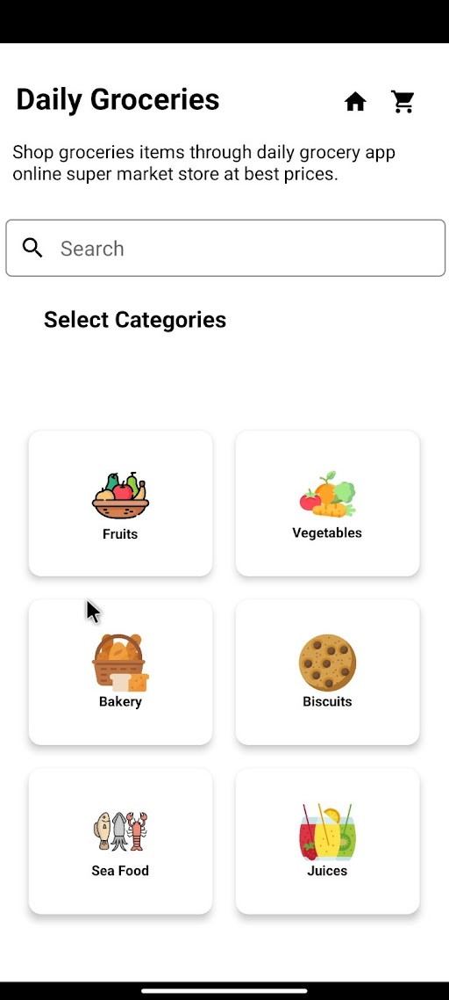
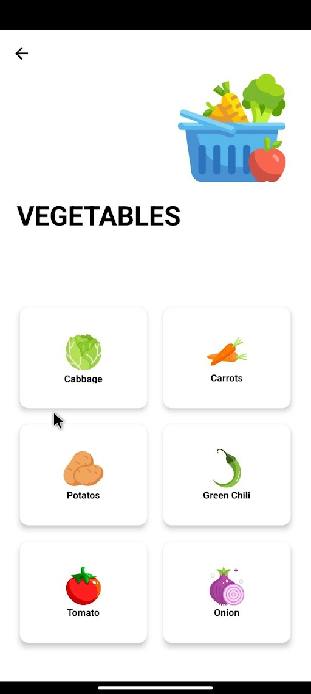
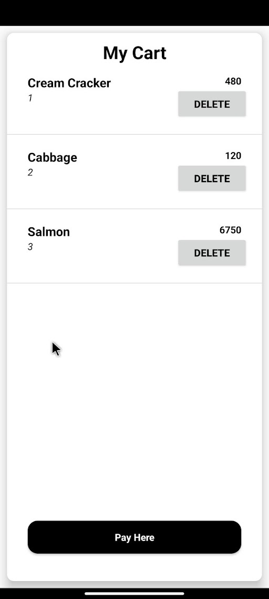
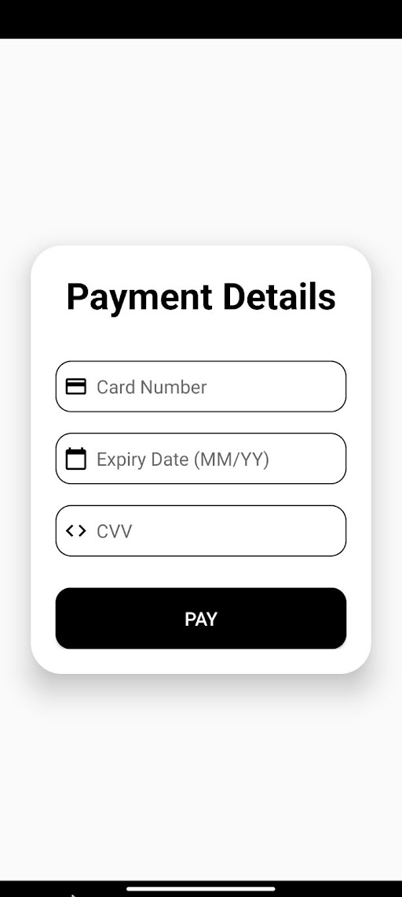
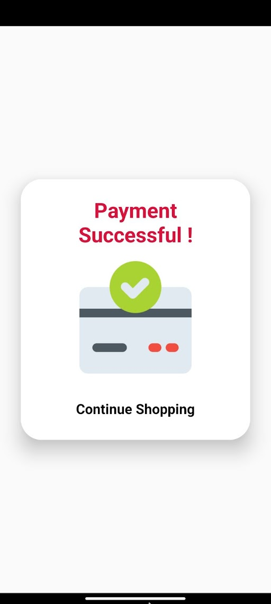

# Grosery 

## Overview
Welcome to the Online Grocery Shopping App! This mobile application project, written in Java, allows users to conveniently buy Grocery online.

## Table of Contents

- Features
- Screenshots
- Getting Started
  - Prerequisites
  - Installation
- Usage
- Contributing
- License

## Features

- Browse a wide selection of fresh vegetables.
- Add items to your cart and place orders.
- View order history and track current orders.
- User-friendly and intuitive interface.
- Secure and simple payment options.

## Screenshots

<div align="center">
  
  
  
  
  
</div>

<div align="center">
  
  
  
</div>

## Getting Started

### Prerequisites

To run the app locally or contribute to the project, you'll need the following:

- Android Studio with the Java development environment set up.
- A compatible Android emulator or a physical Android device for testing.

### Installation

1. Clone this repository to your local machine:
```bash
git clone https://github.com/AhmedAfni/Grosery.git
```
2. Open the project in Android Studio.
3. Build and run the app on your emulator or device.

### Usage

1. Launch the app on your Android device.
2. Browse the available vegetable categories and select the items you wish to purchase.
3. Add selected items to your cart.
4. Proceed to checkout, enter your delivery information, and make a secure payment.
5. Track your orders in the order history section.

### Contributing

We welcome contributions from the open-source community. If you want to contribute to this project, please follow these steps:

1. Fork the repository.
2. Create a new branch for your feature or bug fix: git checkout -b feature/your-feature-name.
3. Make your changes and commit them with meaningful messages.
4. Push your changes to your fork: git push origin feature/your-feature-name.
5. Create a pull request to the main branch of this repository.
6. Wait for your pull request to be reviewed and merged.

### License

This project is licensed under the MIT License - see the LICENSE.md file for details.

